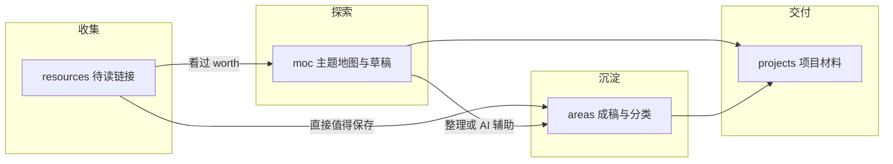

# Repository layout（本仓库目录与工作流）

> **位置**：仓库 **根目录** `REPO_LAYOUT.md` — 本 repo **唯一权威** 的文件夹约定与工作流说明。  
> **通识参考**（各派目录/笔记法模型整理）：[[organization-models-reference]]（`areas/management/`）。  
> **主题地图入口**：[[moc_index]]。

**概要**：根目录四个文件夹 **`projects` / `areas` / `moc` / `resources`**；工作流为 **「`moc/` 探索 → `areas/` 沉淀」**；可用 **AI** 协助把 `moc/` 素材按主题整理进 `areas/`。

---

## 一、一句话与流程

- **`resources`**：先存链接，还没看。  
- **`moc`**：正在好奇、用地图/清单往下挖。  
- **`areas`**：已经消化、要长期查阅的正文。  
- **`projects`**：有起止、可结项的事（可轻量使用）。



---

## 二、四目录约定

| 文件夹 | 角色 | 典型内容 |
|--------|------|----------|
| **`moc/`** | **探索入口**：把「想了解」的用 **地图 / 清单 / 草稿链接** 记下来；**不设独立 `inbox/`**。 | `moc_<主题>.md`、问题列表、半成品结构、探索中的链接汇总。 |
| **`areas/`** | **定居知识**：**按分类长期保存**、以查阅为主；可从 `moc/` 手迁，或由 **AI** 建议子结构后再人工定稿。 | 用自己的话写的笔记、摘要、可复用条目；主题树见下文。 |
| **`projects/`** | **项目式做事**：有明确起止或结项标准；用量可少。 | 每项目一子文件夹，如 `projects/<主题>/`。 |
| **`resources/`** | **链接停车场**：**尚未阅读** 的 URL、文章、视频。 | 单条待读笔记、链接列表、一两句备注。 |

**刻意不设 `inbox/`**：「想搞懂」→ **`moc/`**；「稍后再看」→ **`resources/`**。

---

## 三、当前目录结构（与仓库一致）

```
my-wiki/
├── REPO_LAYOUT.md            ← 本文：本 repo 落地规则
├── projects/
├── areas/
│   ├── management/           ← 目录管理「模型」通识整理（查阅用）
│   │   └── organization-models-reference.md
│   ├── programming/
│   │   ├── ai/
│   │   ├── languages/
│   │   ├── frameworks/
│   │   ├── tools/
│   │   └── algorithms/
│   ├── sports/
│   ├── entertainment/
│   └── life/
├── moc/
│   ├── moc_index.md
│   ├── moc_category_rule.md      ← 占位，指向 management 参考
│   └── moc_organization_models.md ← 占位，指向 management 参考
└── resources/
```

- 文件夹名 **小写**、**英文**（`areas/` 下主题便于排序与检索）。  
- **`areas/`** 内类似 **杜威**：先大类再细分；需要时在名前加数字前缀（如 `10_programming/`）。  
- 探索笔记在 **`moc/`**，建议 **`moc_<主题>.md`**，并在 [[moc_index]] 登记。

### `areas/` 主题分类（当前）

| 路径 | 中文 |
|------|------|
| `areas/management/` | 知识库方法论 / 目录模型参考（非本 repo 操作手册） |
| `areas/programming/` | 编程 |
| `areas/programming/ai/` | 编程 · AI |
| `areas/programming/languages/` | 编程 · 编程语言 |
| `areas/programming/frameworks/` | 编程 · 框架（Web/服务端等速查） |
| `areas/programming/tools/` | 编程 · 工具与前端笔记（如 React/Vue 概念稿） |
| `areas/programming/algorithms/` | 编程 · 算法 |
| `areas/sports/` | 运动 |
| `areas/entertainment/` | 娱乐 |
| `areas/life/` | 生活 |

---

## 四、各目录细则

### `moc/`（探索与地图）

- **总入口**：[[moc_index]]。  
- **与 `areas/`**：`moc/` = **进行中 / 想搞懂**；`areas/` = **已整理 / 反复查**；定稿以 `areas/` 为准。

### `areas/`（沉淀与查阅）

- 标题清晰，尽量 **用自己的话**；在既有主题下增删改。  
- **`areas/management/`**：只放 **PKM/目录管理模型的查阅型整理**（[[organization-models-reference]]），**不放**本文件这种「repo 操作说明」。

### `projects/`（项目）

- 可空；材料建议 **每项目一子文件夹**；结项后可留原地或日后 `archives/`。

### `resources/`（待读）

- **定期清空**；已读：进 `areas/` 或 `moc_*.md`，或删除。  
- **灰色地带**：仍在「想搞懂」→ **`moc/`**；已可成条 → **`areas/`**。

---

## 五、用 AI 将 `moc/` 整理进 `areas/`

1. 在 `moc/` 攒素材。  
2. 提示里粘贴 **`areas/` 主题表**（见上）。  
3. 让 AI 输出 `areas/...` 草稿，你 **校对后保存**。  
4. 在 `moc_*.md` 标注 **「已整理至 → [[笔记名]]」**。

---

## 六、快速决策

| 情况 | 放哪 |
|------|------|
| 只是 URL，还没看 | `resources/` |
| 正在好奇、地图式记录 | `moc/`（`moc_*.md`） |
| 已消化、长期保留 | `areas/` |
| 可结项的任务材料 | `projects/` |

---

## 七、与经典 PARA 的对照

| 经典 PARA | 本库 |
|-----------|------|
| Inbox | **`moc/` + `resources/`** |
| Projects | `projects/` |
| Areas | `areas/` |
| Resources | 本库 **`resources/` 更窄**（待读）；成体系正文在 **`areas/`** |
| Archives | 未默认建立 |

---

## 八、维护节奏（可自选）

- **每周（或双周）**：扫 `resources/`、[[moc_index]]；成熟内容迁向 `areas/`。  
- **分类**：随使用迭代。

---

## 九、文档分工

| 文件 | 定位 |
|------|------|
| **`REPO_LAYOUT.md`（本文）** | 本仓库 **文件夹与工作流**，以本文为准。 |
| **`areas/management/organization-models-reference.md`** | PARA、MOC、杜威、ZK、Johnny.Decimal 等 **模型通识整理**，便于选型与查阅。 |
| **`moc/moc_index.md`** | 主题 MOC 总入口。 |
| **`moc/moc_category_rule.md`**、**`moc/moc_organization_models.md`** | 仅占位，链向 [[organization-models-reference]]，保留文件名以免旧链接断裂。 |
